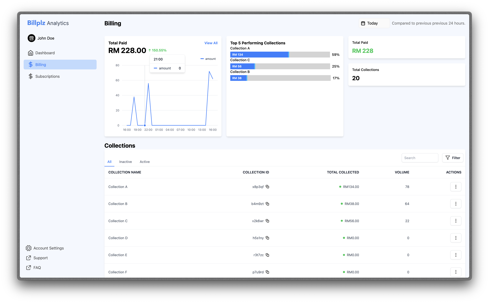

<div align="center">
 
 # Billplz Analytics
 
 Actionable insights for collections, transactions, and payouts — built with Next.js 14, TypeScript, Tailwind, and modern React tooling.
 
 <br/>
 
 
 
 <br/>
 
 
 
 
 
 
 
 
 </div>
 
 ---
 
 ## Table of Contents
 
 - __Overview__
 - __Tech Stack__
 - __Screenshots__
 - __Features__
 - __Key Components__
 - __Project Structure__
 - __API Endpoints__
 - __Getting Started__
 - __Scripts__
 - __Environment__
 - __Coding Standards__
 - __Contributing__
 
 ---
 
 ## Overview
 
 Billplz Analytics is a modern dashboard that highlights collection performance, transaction activity, upcoming payouts, and operational health. It is designed for clarity, speed, and extensibility, using the Next.js App Router and a small set of focused components.
 
 ## Tech Stack
 
 - __Framework__: Next.js 14 (App Router)
 - __Language__: TypeScript
 - __UI__: Tailwind CSS v4, Radix primitives, custom UI components (`src/app/components/ui/*`)
 - __State/Data__: TanStack Query v5 for fetching and caching
 - __Charts__: Recharts and react-google-charts
 - __Dates__: date-fns, @internationalized/date (for time inputs)
 - __Icons__: Remix Icon React
 - __Utilities__: tailwind-variants, tailwind-merge, clsx
 - __Linting__: ESLint (extends `next/core-web-vitals`, `next/typescript`)
 
 ## Screenshots
 
 - Overview Dashboard
 
   
 
 - Billing
 
   
 
 - Subscriptions
 
   
 
 > If you want different screenshots, drop your images into `public/screenshot-readme/` and update the paths above.
 
 ## Features
 
 - __Overview__: Total collections, transactions, payouts, and categorical breakdowns.
 - __Billing__: Range-filtered series, collection-level tables, and deltas between time windows.
 - __Subscriptions__: Summary and status cards (extensible).
 - __Date Range Filtering__: Global date filtering via `filter-date` context and a reusable DatePicker.
 - __Responsive UI__: Mobile-first with utility classes and layout primitives.
 
 ## Key Components
 
 - __Charts__
   - `src/app/components/chart-card.tsx` — shared card for line and pie charts (auto-bucketing and labeling).
   - `src/app/components/ui/charts/line-chart.tsx` — line chart wrapper.
   - `src/app/components/ui/charts/pie-chart.tsx` — pie chart wrapper.
 - __Data Display__
   - `src/app/components/stats-card.tsx` — KPIs and at-a-glance stats.
   - `src/app/components/collection.tsx` — collection performance list/card.
   - `src/app/components/table-billing.tsx` — billing table view.
 - __Filters & Inputs__
   - `src/app/components/calendar-filter.tsx` — quick preset date filters.
   - `src/app/components/date-picker.tsx` — single and range date pickers with optional time.
 - __Layout & Shell__
   - `src/app/components/layout-wrapper.tsx`, `src/app/components/sidebar.tsx`, `src/app/components/header.tsx`.
   - UI primitives: `src/app/components/ui/*` (`button`, `card`, `tabs`, `dropdown`, `drawer`, `dialog`, `table`, etc.).
 
 ## Project Structure
 
 ```txt
 src/
   app/
     (main)/
       overview-page/page.tsx          # Overview dashboard
       billing-page/page.tsx           # Billing analytics
       subscription-page/page.tsx      # Subscriptions
     api/
       collections/route.ts            # Collections endpoint
       transactions/route.ts           # Transactions endpoint
     components/
       ...                             # Cards, charts, tables, UI primitives
     context/filter-date.tsx           # Global date range context
     lib/chartUtils.ts                 # Chart helper utilities
 ```
 
 ## API Endpoints
 
 - `GET /api/transactions`
 - `GET /api/collections`
 
 These return data consumed by the pages and charts. Replace/extend these routes to connect to your live backend.
 
 ## Getting Started
 
 - __Requirements__
   - Node.js >= 18.17 (LTS recommended)
   - npm (or yarn/pnpm/bun)
 
 - __Install__
   ```bash
   npm install
   ```
 
 - __Run (dev)__
   ```bash
   npm run dev
   # http://localhost:3000
   ```
 
 - __Build & Start__
   ```bash
   npm run build
   npm start
   ```
 
 ## Scripts
 
 - `dev` — start Next.js in development
 - `build` — build production output
 - `start` — start production server
 - `lint` — run ESLint (`next lint`)
 
 ## Environment
 
 - `.env` — place environment variables here if/when integrating real APIs.
 - Fonts configured via `next/font/local` in `src/app/layout.tsx`.
 
 ## Coding Standards
 
 - ESLint extends `next/core-web-vitals` and `next/typescript` (`.eslintrc.json`).
 - Prefer functional components and hooks. Keep helpers pure and colocated or hoisted for stability.
 - Tailwind for styling; use `tailwind-variants` for composable variants when needed.
 
 ## Contributing
 
 - Use feature branches and conventional commits when possible.
 - Add tests/documentation for non-trivial changes.
 - Open a PR with a clear description and screenshots for UI changes.
